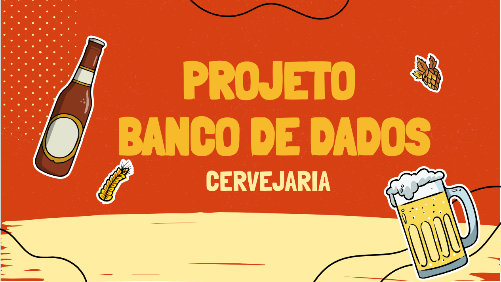
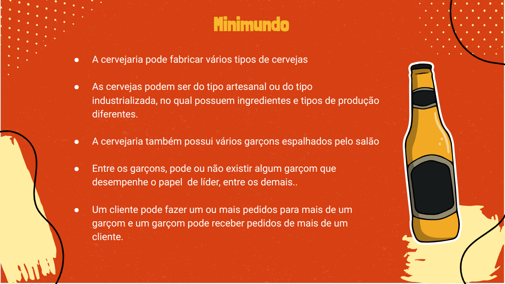

# Cervejaria Du Toninho

Neste documento, exploraremos conceitos fundamentais de gerenciamento de produção cervejeira, destacando a importância da modelagem de dados (Modelo E-R). Esses conceitos serão aplicados posteriormente no desenvolvimento de um sistema que facilitará a compreensão e a organização dos processos de produção de cerveja na Cervejaria Du Toninho.

## Objetivos

Este repositorio faz parte de uma das etapas de construção do projeto referente a construção de um Sistema de Gerenciamento de Banco de Dados.

[](https://docs.google.com/presentation/d/1pl-3dAWFL5a-4FhonfdpXBSs80aHtOeIGicnX1MsWkY/edit?usp=sharing)

[](https://docs.google.com/document/d/1KsMsONTEVW4pmsLyKTdEtrN_dzbyItdrA8IQ80Lyupk/edit?usp=sharing)


## Criação do Banco de Dados

Para este projeto, utilizaremos o PostgreSQL, um sistema de gerenciamento de banco de dados relacional (SGBD), devido à sua popularidade e robustez.

### Script de Criação

O script para a criação do banco de dados é o seguinte:

```sql
create database cervejaria;
```
- No entanto, para executar este comando, você precisará estar conectado a um servidor PostgreSQL.
 
Neste caso usaremos o Docker para criar esse servidor:

```javascript
docker run -d --name cervejaria -e POSTGRES_USER=cervejaria -e POSTGRES_PASSWORD=cervejaria123 -p 5432:5432 postgres
```

# Criação das tabelas:

Os comandos sql para criação das tabelas pode ser encontrado [aqui](Create_tables/create.sql).

# ajustes nas tabelas de Desconto & Escala

Os comandos sql para Alter Table das tabelas pode ser encontrado [aqui](Create_tables/alter_table.sql).


# Inserts:

Os comandos de inserts das tabelas do banco de dados cervejaria podem ser encontrados [aqui](inserts_tables/inserts.sql).

# consultas propostas no minimundo:

As consultas podem ser encontradas [aqui](consultas.sql).