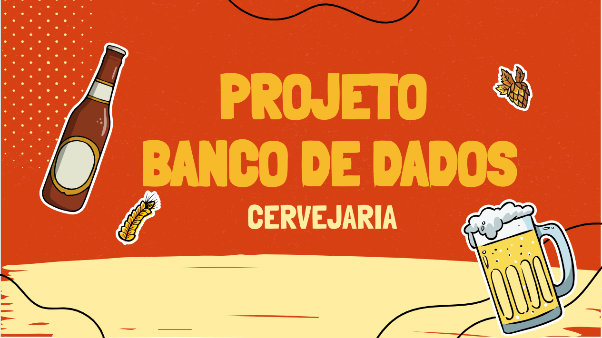
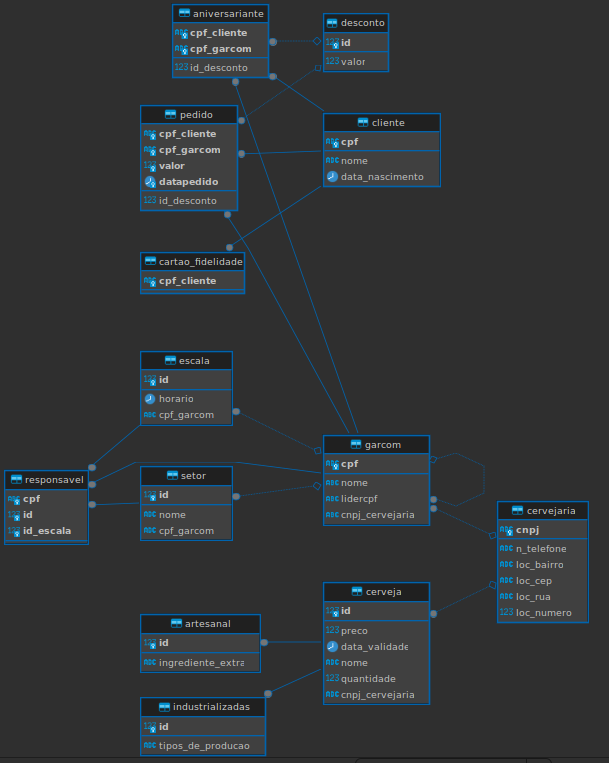
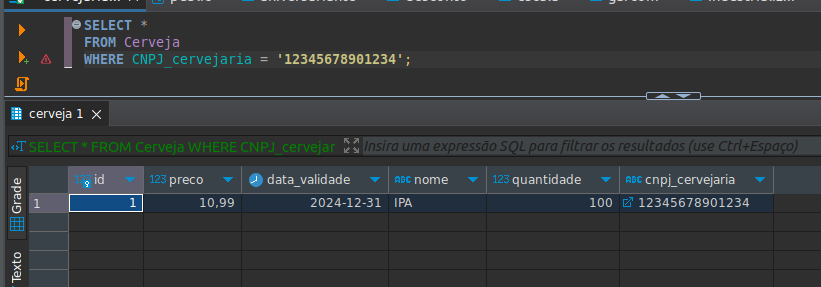
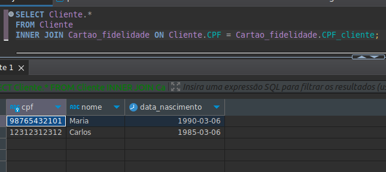
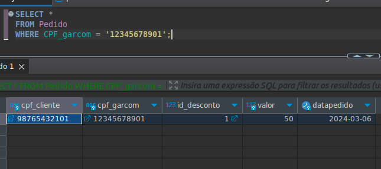
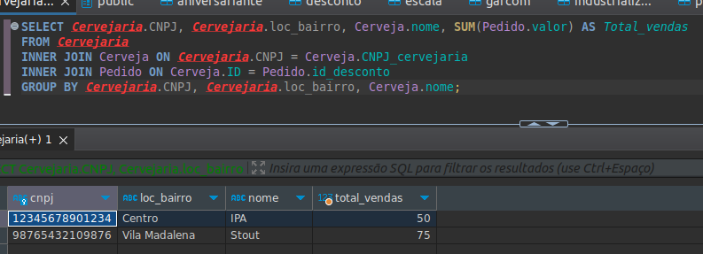
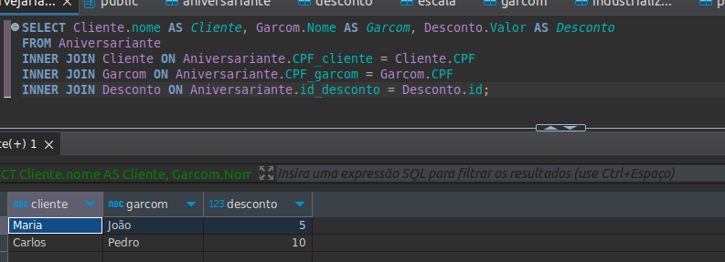
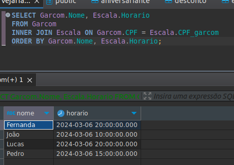
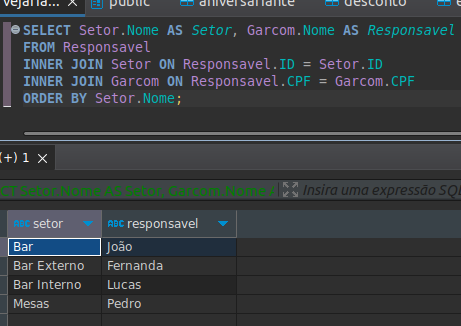
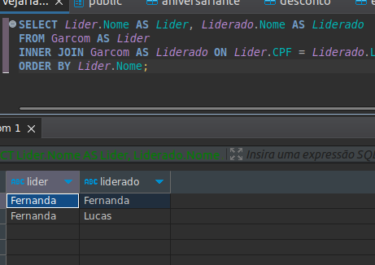

# Cervejaria Du Toninho

Neste Repositorio, exploraremos conceitos fundamentais de gerenciamento de produção cervejeira, destacando a importância da modelagem de dados (Modelo E-R). Esses conceitos serão aplicados posteriormente no desenvolvimento de um sistema que facilitará a compreensão e a organização dos processos de produção de cerveja na Cervejaria Du Toninho.

## Objetivos:

Este repositorio faz parte de uma das etapas de construção do projeto referente a construção de um Sistema de Gerenciamento de Banco de Dados.

[](https://docs.google.com/presentation/d/1pl-3dAWFL5a-4FhonfdpXBSs80aHtOeIGicnX1MsWkY/edit?usp=sharing)

[](https://docs.google.com/document/d/1KsMsONTEVW4pmsLyKTdEtrN_dzbyItdrA8IQ80Lyupk/edit?usp=sharing)


## Criação do Banco de Dados:

Para este projeto, utilizaremos o PostgreSQL, um sistema de gerenciamento de banco de dados relacional (SGBD), devido à sua popularidade e robustez.


Para criar o banco de dados, utilizaremos o seguinte script:

```sql
create database cervejaria;
```
Porém, para executar este comando, é necessário estar conectado a um servidor PostgreSQL(seria algo mais para o live oracle).

Para facilitar este processo, utilizaremos o Docker para criar e gerenciar o servidor PostgreSQL. O comando abaixo não apenas cria o servidor, mas também configura o banco de dados 'cervejaria' por meio do parâmetro `--name`:

```bash
docker run -d --name cervejaria -e POSTGRES_USER=cervejaria -e POSTGRES_PASSWORD=cervejaria123 -p 5432:5432 postgres
```
Este comando executa o seguinte:

- `docker run -d`: Inicia um novo container Docker em segundo plano.
- `--name cervejaria`: Define o nome do container (e do banco de dados) como 'cervejaria'.
- `-e POSTGRES_USER=cervejaria -e POSTGRES_PASSWORD=cervejaria123`: Define as variáveis de ambiente para o nome de usuário e senha do PostgreSQL.
- `-p 5432:5432`: Mapeia a porta 5432 do container para a porta 5432 do host, permitindo que o PostgreSQL seja acessado externamente.
- `postgres`: Especifica a imagem Docker a ser usada, neste caso, a imagem oficial do PostgreSQL.


# Criação das tabelas:

Os comandos sql para criação das tabelas pode ser encontrado [aqui](Create_tables/create.sql).

Os comandos atualizados com correções se encontra [aqui](Create_tables/create_table_ajustado.sql).

- Diagrama de classes ER:




# ajustes nas tabelas de Desconto & Escala:

Os comandos sql para Alter Table das tabelas pode ser encontrado: [Aqui](Create_tables/alter_table.sql).


# Inserts:

Os comandos de inserts das tabelas do banco de dados cervejaria podem ser encontrados: [Aqui](inserts_tables/inserts.sql).

Aqui se encontra os comandos de Updates: [Aqui](inserts_tables/update_inserts.sql).


# consultas propostas no minimundo:

As consultas podem ser encontradas: [Aqui](consultas.sql).

- Cervejas produzidas por uma cervejaria específica



- Clientes que têm um cartão de fidelidade:



- Pedidos atendidos por um garçom específico:



- Relatório de vendas de cerveja por cervejaria:



- Relatório de descontos oferecidos aos aniversariantes:



- Relatório de horários de trabalho dos garçons:



- Relatório de responsáveis por setores:



- Relatório de lideres e liderados:

